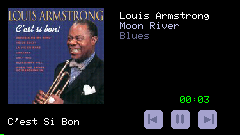
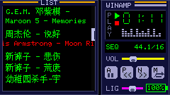

# CardPuter MP3 Player

An advanced MP3 player based on M5Cardputer, featuring Chinese character display, multiple playback modes, and rich control functions.

## Screenshots

### Main View


### ID3 Information Page


## Features

### Audio Playback
- **Format Support**: MP3 and WAV audio formats
- **Auto-Discovery**: Automatically scans `/music` directory (falls back to root if not found)
- **Capacity**: Supports up to 100 songs
- **Playback Modes**:
  - **SEQ (Sequential)**: Plays songs in order, automatically advances to next
  - **RND (Random)**: Random song selection, avoids repeating current song
  - **ONE (Single Repeat)**: Repeats the current song indefinitely
- **Audio Quality**: 
  - Adaptive sample rate support (up to 192kHz)
  - 16-bit depth, stereo output
  - Real-time sample rate and bit depth display
- **ID3 Metadata**: 
  - Displays album cover art (JPEG, PNG, BMP, GIF, QOI formats)
  - Shows title, artist, album information
  - Dedicated ID3 information page (press 'I' key)

### Multi-Language Character Support
- **Full UTF-8 Support**: Displays Chinese, Japanese, and Korean song names correctly
- **Automatic Language Detection**: 
  - **Korean**: Uses `efontKR_12` font (Hangul syllables U+AC00-U+D7AF)
  - **Japanese**: Uses `efontJA_12` font (Hiragana U+3040-U+309F, Katakana U+30A0-U+30FF, Kanji)
  - **Chinese**: Uses `efontCN_12` font (CJK Unified Ideographs U+4E00-U+9FFF)
  - **English/Others**: Default system font
- **Font Priority**: Korean > Japanese > Chinese > Default
- **Optimized Display**: 16-pixel line height for proper CJK character rendering

### User Interface
- **Dual-Panel Layout**:
  - **Left LIST Area**: Song list display (up to 7 visible lines)
    - Color coding: Red (playing), White (selected), Green (others)
    - Smart scrolling for long filenames
    - Circular navigation (wraps around at ends)
  - **Right WINAMP-Style Area**: 
    - Playback status and controls
    - Volume and brightness sliders
    - Battery percentage and time display
    - Spectrum visualization
    - Playback mode indicator (SEQ/RND/ONE)
- **Smart Scrolling**: 
  - Selected song names scroll horizontally after 1 second
  - Scrolling strictly contained within LIST box boundaries
  - Automatic reset when selection changes
- **Clean Display**: File names shown without path and extension

### File Management
- **Song Deletion**: 
  - Confirmation dialog for safety
  - Smart deletion logic: continues playing if deleted song is not current
  - Automatic next song switch if current song is deleted
  - Proper index management after deletion
- **Screenshot Capture**: 
  - Press 'F' to capture current screen
  - Saves as 24-bit BMP format (240x135 pixels)
  - Automatic timestamp in filename
  - Saves to `/screen` directory (auto-created)

### Power Management
- **Screen Control**: 
  - Toggle screen on/off (S key)
  - Automatically saves brightness when turning off
  - Restores saved brightness when turning on
  - Skips drawing operations when screen is off (saves CPU)

### Volume & Brightness Control
- **Volume Control**:
  - Fine control: `-` (decrease) and `=` (increase) keys (step 1)
  - Quick control: `V` key cycles through levels (step 5)
  - Range: 0-21 levels
  - Visual slider with smooth movement
- **Brightness Control**:
  - `L` key cycles through 5 brightness levels
  - Visual indicator on screen

### Performance Optimizations
- **Caching Mechanisms**:
  - Battery display: Updates every 30 seconds
  - Time display: Updates every 1 second
  - Audio info: Updates on track change
- **Update Throttling**:
  - Spectrum graph: Updates every 200ms
  - Text scrolling: Updates every 4 frames
  - Screen refresh: Optimized to 20fps (50ms delay)
- **Memory Management**:
  - Stream-only album cover handling (no RAM caching)
  - Optimized screenshot capture (row-by-row processing)
  - Efficient string operations (snprintf instead of String concatenation)

## Key Controls

### Playback Control
- **A** - Play/Pause toggle
- **N** - Next song
- **P** - Previous song
- **ENTER** - Play currently selected song

### Volume Control
- **V** - Cycle volume levels (step 5, range 0-21)
- **-** - Decrease volume (step 1)
- **=** - Increase volume (step 1)

### List Navigation
- **;** - Navigate up (circular, jumps to last song when at first)
- **.** - Navigate down (circular, jumps to first song when at last)

### Playback Mode
- **M** - Toggle playback mode
  - SEQ: Sequential playback
  - RND: Random playback
  - ONE: Single repeat

### Screen Control
- **L** - Cycle screen brightness (5 levels)
- **S** - Screen off/on toggle (saves brightness when off, restores when on)

### File Management
- **D** - Show delete confirmation dialog
  - **Y** - Confirm delete currently selected song
  - **C** - Cancel delete

### Screenshot
- **F** - Capture screenshot and save to SD card
  - Screenshots are saved in `/screen` directory
  - Filename format: `screenshot_YYYYMMDD_HHMMSS.bmp`
  - Automatically creates `/screen` directory if it doesn't exist
  - Saves as 24-bit BMP format (240x135 pixels)

## Technical Details

### Hardware Support
- **M5Cardputer Variants**:
  - Standard version (AW88298 codec)
  - Advanced version (ES8311 codec)
- **Auto-Detection**: Automatically detects hardware variant and configures appropriate audio driver
- **Headphone Detection**: Automatic amplifier state switching when headphones are inserted/removed
- **Audio Library**: ESP32-audioI2S (version 2.0.0)

### Code Architecture
- **Modular Design**: 
  - Separated into 8 independent modules for better maintainability
  - Clear interface boundaries and responsibilities
  - Reduced main file from ~1800 to ~420 lines (76% reduction)
- **State Management**: Centralized application state in `AppState` structure
- **Configuration**: All constants centralized in `config.hpp`
- **Logging**: Unified logging system with compile-time switches

## File Structure

```
/music/          # Recommended music file directory
  ├── song1.mp3
  ├── song2.wav
  └── ...
/screen/         # Screenshot directory (auto-created)
  ├── screenshot_20240117_120530.bmp
  └── ...
```

## Dependencies

- M5Cardputer (^1.0.3)
- ESP32-audioI2S (2.0.0) - https://github.com/schreibfaul1/ESP32-audioI2S.git
- ESP32Time (^2.0.6)
- FastLED (^3.3.3)
- Adafruit NeoPixel (^1.10.6)

## Build Instructions

Use PlatformIO to compile and flash.

## Version History

For detailed changelog, please see [CHANGELOG.md](CHANGELOG.md).

**Current Version**: 2.2.0

**Recent Highlights**:
- Enhanced ID3 information page with playback controls and progress bar
- Improved UI layout with dynamic text positioning
- Fixed screenshot color conversion issue
- Added interface screenshots to documentation

**Previous Major Versions**:
- **v2.0.0**: Multi-language support, playback modes, ID3 display, screenshot feature
- **v1.0.0**: Initial release with basic MP3/WAV playback

## Notes

- Ensure SD card is formatted as FAT32
- Audio files are recommended to be placed in `/music` directory
- Deleting songs permanently removes files from SD card, use with caution
- In single repeat mode, the song automatically repeats after finishing
- Screenshots are saved as BMP files and can be viewed on any device that supports BMP format
